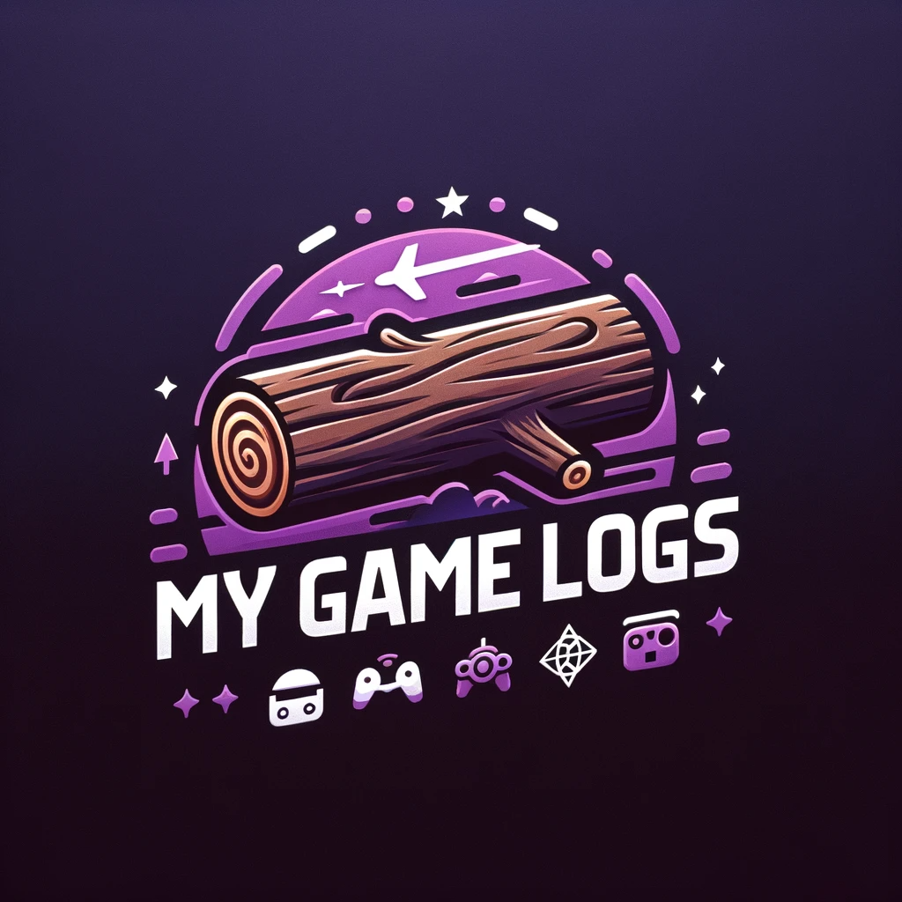

# My Game Log



## Project Description
My Game Log is an innovative solution designed for enthusiasts of physical games and console collections. It offers a personalized experience on a local webserver to store, track, and organize your game collections efficiently. It also provides a tool to generate QR codes pointing to specific collection pages, in a printable manner.

## Installation and Running Instructions

### Virtual Environment

We recommend installing and running this software in a virtual environment of your choice.


### Prerequisites
- Python > 3.11
- Installing the libraries and dependencies on the requirements.txt file

### Steps
1. Clone the repository:
```python
    git clone https://github.com/pablovin/myGameLog.git
```

2. Install Python and a virtual environment of your choice (For example, VEnv or Conda):
    - https://www.python.org/
    - Venv: https://docs.python.org/3/library/venv.html
    - or Conda: https://docs.conda.io/en/latest/


## Usage
After setting up My Game Log, you can access the web interface through any browser. The intuitive UI allows you to:

- Import new games and consoles to your collection via the .XML import function.
- Edit existing entries.
- Search and filter through your collection.
- Generate ready-to-print QR-Codes to provide a quick access to your collection.

## Configuration and Installation on a Local Server

To set up My Game Log on a Raspberry Pi Zero 2W:

1. Flash Raspberry Pi OS onto your SD card.
2. Connect your Raspberry Pi to the network.
3. Follow the Installation and Running Instructions above to set up My Game Log.
4. Configure your Raspberry Pi to start the server on boot.

(Will be updated soon!)

## Support

For any questions or issues, please open an issue on the GitHub repository, and we will assist you as soon as possible.

---

Enjoy organizing your game collection with My Game Log!